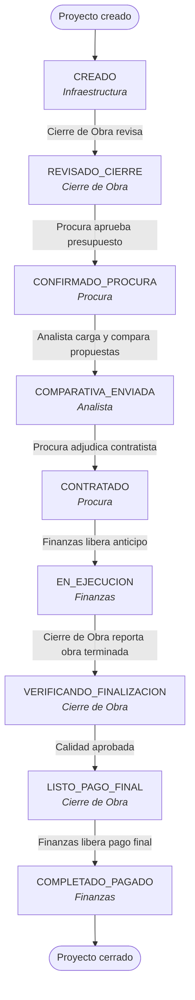

### Diagrama del recorrido de un proyecto

```mermaid
flowchart TD
    Start(["Proyecto creado"]) --> CREADO

    CREADO["CREADO<br/><i>Infraestructura</i>"] -->|Cierre de Obra revisa| REVISADO["REVISADO_CIERRE<br/><i>Cierre de Obra</i>"]
    REVISADO -->|Procura aprueba presupuesto| CONFIRMADO["CONFIRMADO_PROCURA<br/><i>Procura</i>"]
    CONFIRMADO -->|Analista carga y compara propuestas| COMPARATIVA["COMPARATIVA_ENVIADA<br/><i>Analista</i>"]

    COMPARATIVA -->|Procura adjudica contratista| CONTRATADO["CONTRATADO<br/><i>Procura</i>"]

    CONTRATADO -->|Finanzas libera anticipo| EJECUCION["EN_EJECUCION<br/><i>Finanzas</i>"]
    EJECUCION -->|Cierre de Obra reporta obra terminada| VERIFICANDO["VERIFICANDO_FINALIZACION<br/><i>Cierre de Obra</i>"]

    VERIFICANDO -->|Calidad aprobada| LISTO["LISTO_PAGO_FINAL<br/><i>Cierre de Obra</i>"]

    LISTO -->|Finanzas libera pago final| COMPLETADO["COMPLETADO_PAGADO<br/><i>Finanzas</i>"]
    COMPLETADO --> End(["Proyecto cerrado"])
```