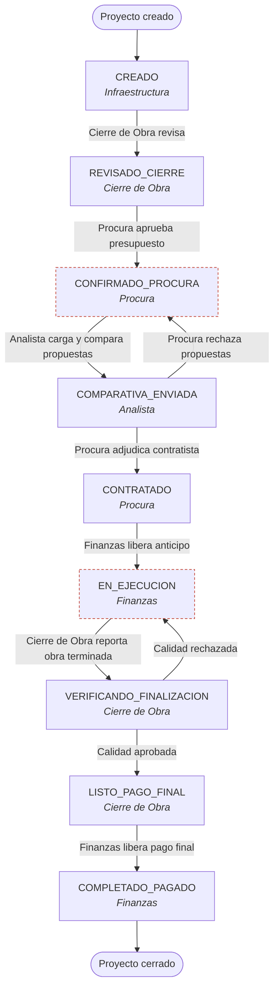

# Flujo de Trabajo del Sistema de Infraestructura

Este documento describe los roles, permisos y el ciclo de vida completo de un proyecto (obra de infraestructura o mantenimiento) dentro del sistema, desde su creación hasta su cierre y pago final.

Fuentes: `routes/api.php`, `app/Http/Controllers/Api/ProjectController.php`, `app/Http/Controllers/Api/DashboardSummaryController.php`, `app/Http/Middleware/CheckRole.php`, `config/permissions.php`, `app/Models/Project.php`, `app/Observers/ProjectObserver.php`, `tests/Feature/ProjectLifecycleTest.php`, `tests/Feature/RoleMiddlewareTest.php`, y el router del frontend `src/routes/AuthenticatedRoutes.tsx`.

---

## 1. Roles del sistema

Los roles son un campo de texto simple en `users.role` (no hay tablas `roles`/`permissions`); la autorización real ocurre en cada endpoint vía middleware `role:`.

| Rol | Panel / ruta frontend | Responsabilidad principal |
|---|---|---|
| **SUPERADMIN** | Acceso total | Administración completa del sistema, incluida `/presidencia` |
| **ADMIN** | Acceso total salvo `/presidencia` | Administración operativa (usuarios, catálogos, config) |
| **PRESIDENCIA** | `/presidencia`, `/catalogos` | Visión ejecutiva agregada del portafolio. **Solo lectura**, sin acciones sobre proyectos |
| **INFRAESTRUCTURA** | `/infraestructura` | Crea las peticiones de obra/mantenimiento (inicio del flujo) |
| **CIERRE_DE_OBRA** | `/cierre-obra` | Revisión técnica inicial (planos/cálculos) y verificación final de calidad |
| **PROCURA** | `/procura`, `/catalogos` | Aprueba presupuesto, rechaza propuestas, adjudica contratista |
| **ANALISTA** | `/analistas` | Carga y compara propuestas de contratistas, envía comparativa |
| **FINANZAS** | `/finanzas` | Libera pagos (anticipo y final) |
| **CATALOGOS** | `/catalogos` | Consulta de catálogo de proveedores (sin panel operativo propio) |

Notas:
- La matriz de `config/permissions.php` controla solo **navegación/UI**; la autorización real de cada acción la impone el middleware `role:` en `routes/api.php`.
- `PRESIDENCIA` está confirmado (por test) como el único rol operativo sin acceso a ningún endpoint de transición de estado — es puramente de consulta.
- Existe además un portal público (sin login) para proveedores externos, vía enlaces de invitación de único uso (`SupplierInvitation`).

---

## 2. El proyecto: modelo y estados

Un **Proyecto** (`app/Models/Project.php`, tabla `projects`) representa una obra de tipo `INFRAESTRUCTURA` o `MANTENIMIENTO`. Su ID es tipo `PRJ-001`, `PRJ-002`... generado de forma segura ante concurrencia.

Campos clave: `title`, `type`, `description`, `location`, `estimated_total`, `status`, notas de revisión (`cierre_obra_notes`, `procura_review_notes`), `approved_investment_amount`, `selected_contractor_code`, `selected_proposal_id`, `quality_verified`, `completion_verified_date`.

Relaciones: `materials` (lista inicial de materiales), `proposals` (ofertas de contratistas), `payments` (anticipo/final), `documents` (planos, hojas de cálculo), `auditLogs` (bitácora inmutable de cada transición).

### Diagrama del recorrido de un proyecto



*(Las flechas punteadas conceptuales de retroceso son `COMPARATIVA_ENVIADA → CONFIRMADO_PROCURA` y `VERIFICANDO_FINALIZACION → EN_EJECUCION`, mostradas arriba como aristas adicionales hacia esos mismos nodos.)*

### Los 9 estados del proyecto

```
CREADO
  → REVISADO_CIERRE
    → CONFIRMADO_PROCURA
      → COMPARATIVA_ENVIADA
        → CONTRATADO
          → EN_EJECUCION
            → VERIFICANDO_FINALIZACION
              → LISTO_PAGO_FINAL
                → COMPLETADO_PAGADO
```

Con dos caminos "hacia atrás" excepcionales:
- `COMPARATIVA_ENVIADA → CONFIRMADO_PROCURA` (Procura rechaza todas las propuestas)
- `VERIFICANDO_FINALIZACION → EN_EJECUCION` (Cierre de Obra rechaza la calidad de la obra terminada)

---

## 3. Ciclo de vida paso a paso

| # | Transición | Quién | Endpoint | Qué ocurre |
|---|---|---|---|---|
| 1 | `— → CREADO` | **INFRAESTRUCTURA** | `POST /projects` | Se crea la petición de obra con su lista de materiales |
| 2 | `CREADO → REVISADO_CIERRE` | **CIERRE_DE_OBRA** | `POST /projects/{id}/review` | Revisión técnica: planos, cálculos, notas |
| 3 | `REVISADO_CIERRE → CONFIRMADO_PROCURA` | **PROCURA** | `POST /projects/{id}/approve-investment` | Aprueba el monto de inversión (`approved_investment_amount`), que rige el resto del proyecto |
| 4 | *(sin cambio de estado)* | **ANALISTA** | `POST /projects/{id}/proposals`, `POST /projects/{id}/import-supplier-proposals` | Carga propuestas de contratistas, manualmente o importadas del portal público de proveedores |
| 5 | `CONFIRMADO_PROCURA → COMPARATIVA_ENVIADA` | **ANALISTA** | `POST /projects/{id}/submit-comparative` | Envía el cuadro comparativo de propuestas (requiere al menos una propuesta cargada) |
| 6a | `COMPARATIVA_ENVIADA → CONTRATADO` | **PROCURA** | `POST /projects/{id}/select-contractor` | Adjudica el contratista ganador |
| 6b | `COMPARATIVA_ENVIADA → CONFIRMADO_PROCURA` | **PROCURA** | `POST /projects/{id}/reject-proposals` | Rechaza todas las propuestas (con motivo obligatorio) y vuelve a la etapa de comparativa |
| 7 | `CONTRATADO → EN_EJECUCION` | **FINANZAS** | `POST /projects/{id}/payments` (anticipo) | Libera el pago de anticipo al contratista |
| 8 | `EN_EJECUCION → VERIFICANDO_FINALIZACION` | **CIERRE_DE_OBRA** | `POST /projects/{id}/report-finished` | Reporta que la obra fue finalizada en campo |
| 9a | `VERIFICANDO_FINALIZACION → LISTO_PAGO_FINAL` | **CIERRE_DE_OBRA** | `POST /projects/{id}/verify-completion` | Verifica calidad OK |
| 9b | `VERIFICANDO_FINALIZACION → EN_EJECUCION` | **CIERRE_DE_OBRA** | `POST /projects/{id}/verify-completion` | Rechaza calidad, la obra vuelve a ejecución |
| 10 | `LISTO_PAGO_FINAL → COMPLETADO_PAGADO` | **FINANZAS** | `POST /projects/{id}/payments` (final) | Libera el pago final. Cierre del proyecto |

### Guardas de integridad

Cada transición valida explícitamente el estado previo del proyecto (no solo el rol del usuario), devolviendo error 422 si se intenta, por ejemplo, pagar un anticipo sin contratista adjudicado o reabrir un proyecto ya `COMPLETADO_PAGADO`. Esto se añadió tras una auditoría que detectó que Finanzas podía pagar proyectos en cualquier estado.

### Auditoría

Cada transición de estado genera un registro inmutable en `AuditLog` (rol actor, acción, detalles, snapshot del título del proyecto y nombre de usuario en ese momento). La única excepción es el reporte de obra finalizada (paso 8), que se registra con rol `SISTEMA`.

### Notificaciones

Al cambiar de estado, `ProjectObserver` notifica (push) a los roles responsables de la siguiente etapa: p. ej. al llegar a `CREADO` se notifica a Cierre de Obra; a `REVISADO_CIERRE`, a Procura; a `CONFIRMADO_PROCURA`, a Analistas; y desde `CONTRATADO` en adelante se notifica también a Finanzas, Presidencia e Infraestructura para visibilidad ejecutiva.

---

## 4. Módulos satélite

- **Portal público de proveedores**: enlaces de invitación de único uso (`SupplierInvitation`) que permiten a un contratista externo, sin login, enviar una propuesta de materiales (`SupplierMaterialProposal`), que luego el Analista puede importar al proyecto.
- **Evaluación por IA**: `POST /ai/evaluate-proposals` (rol Procura/Admin) evalúa automáticamente propuestas usando IA (con failover entre proveedores), configurable desde `/config-ia`.
- **Catálogos**: gestión de materiales (`/config-materiales`) y contratistas (`/config-proveedores`), reservada a Admin/Superadmin; consulta general disponible en `/catalogos`.
- **Gestión de usuarios**: alta, edición de rol y estado (activo/inactivo) de usuarios, reservada a Admin/Superadmin (`/usuarios`).

---

## 5. Dashboard de Presidencia

`GET /api/dashboard/summary` (roles `PRESIDENCIA`, `SUPERADMIN`) es el único punto de agregación server-side para la vista ejecutiva, calculado sobre el dataset completo de proyectos (no paginado) para que los KPIs sean exactos.

Entrega:
- Totales de inversión aprobada, fondos liberados, monto comprometido con contratistas, fondos pendientes
- **Embudo (`funnel`)**: conteo y monto por cada uno de los 9 estados, en orden canónico
- Desglose por tipo de obra, por ubicación, tendencia mensual de creación de proyectos
- Top 5 contratistas por monto adjudicado
- **Proyectos estancados**: obras no cerradas sin actividad ≥14 días, como señal de riesgo
- Métricas de negociación: % de anticipo promedio y semanas de entrega, sobre propuestas ganadoras

El frontend (`PresidenciaDashboard`) consume este endpoint con un fallback de cálculo local si el backend no responde, marcando los datos como "parciales" en ese caso. Presidencia ve todo el portafolio pero no puede ejecutar ninguna acción sobre los proyectos: su rol es exclusivamente de supervisión.
